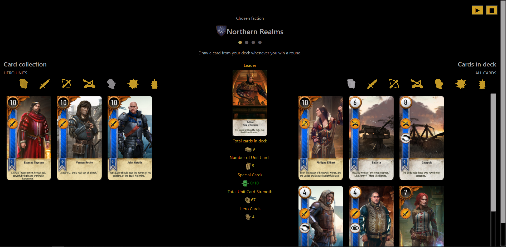

# w3_gwent_deckbuilder

An attempt to implement a copy of the deckbuilder from The Witcher 3.
Features:
* leaders selection 
* cards in deck are saved to local storage
* dynamic favicon based on picked faction
* music player
* card filters

## How to run
1. download repository
2. open index.html in a browser

# Preview

